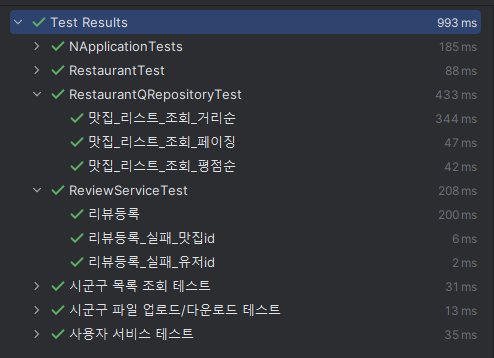

# 지리 기반 맛집 추천 서비스

## 팀 소개
<div align="center">

|  |                 |    |    |  
|:-------------------------------------------------------------------:|:----------------------------------------------------------------------------------:|:---------------------------------------------------------------------:|:---------------------------------------------------------------------:|  
|                            Back-End (팀장)                            |                                      Back-End                                      |                               Back-End                                |                               Back-End                                |                                                                                                 |
|                 [이준규](https://github.com/junkyu92)                  |                         [이현정](https://github.com/12hyeon)                          |                  [최승호](https://github.com/madst0614)                  |                  [조현수](https://github.com/HyunsooZo)                  |

</div>

## 목차
- [개요](#개요)
- [프로젝트 일정](#프로젝트-관리-및-일정)
- [사용기술](#사용기술)
- [API 문서](#API-문서)
- [구현 기능](#구현기능)
- [테스트코드](#테스트코드)
- [시스템 구성도](#시스템-구성도)
- [ERD](#ERD)
- [TIL 및 회고](#프로젝트-관리-및-회고)


## 개요

본 서비스는 공공 데이터를 활용하여, 지역 음식점 목록을 자동으로 앱에 업데이트 합니다 .<br>
사용자는 `현재 위치` 또는 `원하는 위치`를 설정 하여 `맛집 및 메뉴를 추천` 받을 수 있습니다. <br>
또한 `리뷰 시스템`을 통해 더 나은 음식 경험을 제공하고, 다른 사람과 음식에 관해 소통을 하고 공유를 받는 경험을 할 수 있습니다.<br>


## 프로젝트 일정
[-%23000000.svg?style=for-the-badge&logo=notion&logoColor=white)](https://www.notion.so/43d02b90078343ffbf2d8988d81b67c5?v=bcf39f768aeb4ce180c288b5edfe43ef)

## 사용기술

#### 개발환경
   
<br>
     
<br>
 
<br>
  

#### 배포환경
  
<br>
 

#### 협업도구
 
<br/>

## API 문서
[-85EA2D?&logo=swagger&logoColor=white)](http://52.79.93.98:8080/swagger-ui/index.html#/)


| API Type           | Http Method | URL                                  | Description   |
|--------------------|-------------|--------------------------------------|---------------|
| **Auth API**       | POST        | `/api/v1/auth/token/access`          | 엑세스토큰 재발급     | 
| **User API**       | POST        | `/api/v1/users/sign-up`              | 회원가입          |
| **User API**       | POST        | `/api/v1/users/sign-in`              | 로그인           |
| **User API**       | POST        | `/api/v1/users/sign-out`             | 로그아웃          |
| **User API**       | PATCH       | `/api/v1/users/update-loc`           | 위치 업데이트       |
| **User API**       | PATCH       | `/api/v1/users/lunch-served`         | 점심 제공 여부 업데이트 |
| **User API**       | GET         | `/api/v1/users/info`                 | 사용자 정보 가져오기   |
| **Restaurant API** | GET         | `/api/v1/restaurants`                | 맛집 리스트        |
| **Restaurant API** | GET         | `/api/v1/restaurants/{restaurantId}` | 맛집 상세정보       |
| **Review API**     | POST        | `/api/v1/reviews`                    | 리뷰 등록         |
| **SggLatLon API**  | Post        | `/api/v1/files`                      | csv 업데이트      |
| **SggLatLon API**  | GET         | `/api/v1/files/template`             | csv 양식 다운로드   |
| **SggLatLon API**  | GET         | `/api/v1/files`           | 시군구 목록 조회     |


## 구현기능

<details>
  <summary>위치 기반 맛집 리스트 조회 기능</summary>

- **구현 기능** <br>
    - 특정 위치에서 범위 내 맛집을 조회합니다.

- **구현 방법**<br>
    - 위도, 경도, 범위를 입력받아 해당 좌표에서 범위 내 맛집을 조회합니다.
    - 거리 계산은 하버사인 공식을 이용해 쿼리내에서 진행하였습니다.
    - 기본 정렬은 거리 가까운 순으로 제공하고, 정렬 조건이 rate일 경우에 평점 높은 순으로 정렬하여 조회합니다.
    - 기본 15개로 페이징되어 제공되고 size, page 파라미터로 페이징 컨트롤 가능합니다.
</details>

<details>
  <summary>맛집 상세 정보 조회 기능</summary>

- **구현 기능** <br>
    - 맛집의 상세정보를 조회합니다.

- **구현 방법**<br>
    - 맛집ID로 맛집의 상세정보, 전체 리뷰 리스트를 조회합니다.
    - fetch join을 사용해 한번에 하위 항목까지 모두 조회합니다.
    - Redis를 사용해 캐싱을 적용하였습니다.
    - Redis에 데이터가 존재하면 Redis에서 데이터를 반환하고 존재하지 않으면 DB에서 조회하여 Redis에 저장 후 데이터를 반환합니다.
</details>

<details>
  <summary>리뷰 등록 기능</summary>

- **구현 기능** <br>
    - 리뷰를 등록합니다.

- **구현 방법**<br>
    - 평점과 리뷰 내용을 등록합니다.
    - 리뷰 등록시 맛집의 평점과 리뷰수를 업데이트 합니다.
    - 리뷰 등록시 Redis에 캐싱되어있는 해당맛집의 데이터를 삭제하여 최신화되도록 했습니다.
</details>

## 테스트코드


## 시스템 구성도


## ERD


## TIL 및 회고
- 맛집 상세정보 조회시 캐싱을 적용하기 위해 Redis를 처음으로 사용해보았다. Redis에 저장하고 조회하는 기술 적용은 
생각보다 간단했지만 데이터를 어떤 형태로 저장할지 데이터가 변경될 때 어떻게 반영할지 전략을 선택하는 것이 어려웠다.
- 조회 전략은 캐시에 있으면 캐시에서 조회하고 없으면 DB에서 조회해 캐시에 저장하는 Look Aside전략을 사용했고 
저장형태는 키는 스트링, 데이터는 Json을 스트링으로 변환하여 저장하였다.
리뷰가 등록될때마다 캐싱된 데이터에도 반영이 되어야 했기 때문에 리뷰가 등록되면 해당 맛집의 캐싱 데이터를 제거하는 방식을 사용했다.
이 방식은 다음 조회때 DB에서 조회해 Redis에 저장하기 때문에 속도는 조금 느릴 수 있지만 
Redis와 DB의 데이터 정합성이 가장 좋다고 판단해서 사용했다.

<details>
  <summary>ISSUE: 테스트코드에서 OneToMany 어노테이션이 작동하지 않는 현상</summary>

- 구글링을 많이 해보았지만 검색으로는 명확한 원인을 찾지 못했고 추측으로는 DB에 등록되기 전 영속성 컨텍스트에서 관리하는 상태에서는 OneToMany
가 작동하지 않는 것 같다.
- Transactional propagation을 SUPPORTS로 설정해 OneToMany 문제는 해결했는데 DB에 테스트코드에서 입력한 데이터가
롤백되지 않고 남아있었다.
- 테스트용 DB를 따로 생성해서 데이터를 미리 넣어 놓아야 될 것 같아서 테스트코드로 사용하기 적합하지 않다고 판단하여 삭제했다. 
</details>

<details>
  <summary>ISSUE: Redis 데이터 저장시 에러1</summary>

- 원인
  - 자바 LocalDatetime 타입 직렬화시 에러 발생
  ```
    "Could not write JSON: Java 8 date/time type `java.time.LocalDateTime` not supported by default: add Module \"com.fasterxml.jackson.datatype:jackson-datatype-jsr310\" to enable handling (through reference chain: wanted.n.dto.RestaurantDetailResponseDTO[\"reviewList\"]->java.util.ArrayList[0]->wanted.n.dto.RestaurantDetailResponseDTO$ReviewDTO[\"createdAt\"]); nested exception is com.fasterxml.jackson.databind.exc.InvalidDefinitionException: Java 8 date/time type `java.time.LocalDateTime` not supported by default: add Module \"com.fasterxml.jackson.datatype:jackson-datatype-jsr310\" to enable handling (through reference chain: wanted.n.dto.RestaurantDetailResponseDTO[\"reviewList\"]->java.util.ArrayList[0]->wanted.n.dto.RestaurantDetailResponseDTO$ReviewDTO[\"createdAt\"])"
  ```
- 해결 방법
  - redis config cachemanager 생성부분에 설정 추가
  ```
    // 자바 LocalDatetime 직렬화에 필요한 설정 
    // gradle : implementation 'com.fasterxml.jackson.datatype:jackson-datatype-jsr310'
    ObjectMapper objectMapper = new ObjectMapper();
    objectMapper.registerModule(new JavaTimeModule());
    
    // Redis 캐시 설정 구성
    RedisCacheConfiguration cacheConfiguration = RedisCacheConfiguration.defaultCacheConfig()
            .entryTtl(Duration.ofDays(1)) // 캐시 항목의 만료 기간을 1일로 설정
            .serializeKeysWith(
                    RedisSerializationContext.SerializationPair
                            .fromSerializer(new StringRedisSerializer())) // 캐시 키를 문자열로 직렬화
            .serializeValuesWith(
                    RedisSerializationContext.SerializationPair
                            .fromSerializer(new GenericJackson2JsonRedisSerializer(objectMapper))); // 캐시 값을 JSON으로 직렬화
  ```
</details>

<details>
  <summary>ISSUE: Redis 데이터 저장시 에러2</summary>

- 원인
  - GenericJackson2JsonRedisSerializer에 ObjectMapper설정 후 에러 발생
  - GenericJackson2JsonRedisSerializer은 기본적으로 직렬화/역직렬화 시 class type 정보를 포함하는데 ObjectMapper를 커스텀하여 설정하면 적용되지 않는다.
  - 따라서 아래와 같이 기본형이 LinkedHashMap으로 역직렬화를 시도하여 에러가 발생한다.
  ```
    class java.util.LinkedHashMap cannot be cast to class wanted.n.dto.RestaurantDetailResponseDTO (java.util.LinkedHashMap is in module java.base of loader 'bootstrap'; wanted.n.dto.RestaurantDetailResponseDTO is in unnamed module of loader 'app')
  ```
- 해결 방법
  - GenericJackson2JsonRedisSerializer에 objectMapper를 사용할 시 필요한 설정 추가
  - 직렬화/역직렬화 시 class type 정보를 포함하도록 설정
  ```
    PolymorphicTypeValidator typeValidator = BasicPolymorphicTypeValidator
        .builder()
        .allowIfSubType(Object.class)
        .build();
    objectMapper.activateDefaultTyping(typeValidator, ObjectMapper.DefaultTyping.NON_FINAL);
  ```
</details>